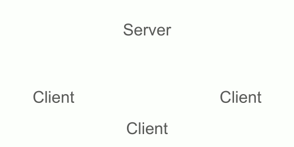

# Basic Design Overview

## Background
### Goal
The goal of this exploration is to understand the communication flow for multiplayer LAN games on BW/SC/Cosmonarchy in order to identify potential WAN game options. Specifically working around [this issue](https://docs.zerotier.com/windows-lan-game/) having to do with the difficulty of getting broadcast packets to be sent on the correct interface when using a VPN or other WAN architecture.

### Announcements, Requests and Replies

When a new BW client enters the multiplayer UDP mode it begins sending broadcast requests (to `255.255.255.255`).
Example broadcast request:
```
0000   ff ff ff ff ff ff 46 4c 77 c6 2d 4b 08 00 45 00   ......FLw.-K..E.
0010   00 30 c7 e3 00 00 80 11 f2 85 c0 a8 bf ab ff ff   .0..............
0020   ff ff 17 df 17 df 00 1c 25 ce d7 dc 14 00 02 00   ........%.......
0030   00 00 57 42 4d 43 cb 3d cc 35 00 00 00 00         ..WBMC.=.5....
```
As you can see part of the message can be decoded as ASCII text (WBMC = CMBW backwards? Cosmonarchy brood war is the client in this case)

If there are any clients who are hosting a game on the network they will reply with a map announcement.
Example map announcement:
```
0000   ff ff ff ff ff ff 46 4c 77 c6 2d 4b 08 00 45 00   ......FLw.-K..E.
0010   00 69 c7 e8 00 00 80 11 f2 47 c0 a8 bf ab ff ff   .i.......G......
0020   ff ff 17 df 17 df 00 55 98 e8 d4 20 4d 00 00 00   .......U... M...
0030   00 00 57 42 4d 43 cb 3d cc 35 00 00 00 00 4a 65   ..WBMC.=.5....Je
0040   73 73 65 00 2c 34 34 2c 2c 33 2c 2c 31 65 2c 2c   sse.,44,,3,,1e,,
0050   31 2c 63 62 32 65 64 61 61 62 2c 31 2c 2c 4a 65   1,cb2edaab,1,,Je
0060   73 73 65 0d 41 78 69 6f 6d 0d 00 0c 00 00 00 01   sse.Axiom.......
0070   00 00 00 08 00 00 00                              .......
```
Again you can see some of the data is ASCII text including the aforementioned WBMC = 5, my BW username Jesse, and the map name Axiom

This message can either be an announcement to the broadcast address `255.255.255.255` or a reply to to address of a client sending a request as seen above.

### Message flow
A sample message flow might look something like this:
- GameHostUser opens a lobby: announcement sent to `255.255.255.255`
- Player opens the UDP lobby list and begins sending request packets to `255.255.255.255` once per second
- GameHostUser replies _directly_ to Player's IP with map announcement
- if the Player then joins the game, all further traffic is unicast between host & player directly

## Potential for a Multicast Relay Server
A Broodwar client will reply to any request packet with a map announcement if they're hosting. This announcement could then be cached and redistributed. Imagine a scenario where there's a matchmaking server on the same subnet as a number of BW clients and broadcast is not an option. The following could be done:
Server loop performed every (n) seconds:

1. the server uses sends a request packet to all clients on the network
   - sends _individual_ unicast messages to all "subscribed" clients using their laye3 IP address instead of an ethernet broadcast
   - clients who are hosting games will respond with their map announcements
2. the server listens for announcements, and relays any it receives to all users on the network
   - server would need to manually craft UDP packet using the host's IP address as the "from" address in the UDP header
Animation of communication flow:


